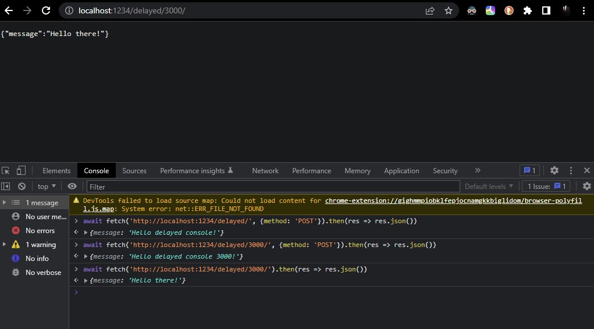

<a href="https://www.core-code.io/">


</a>

# Forrest Gump Ping-Pong API 🏓 && Delayed Response API ⏳:


## Forrest Gump Ping-Pong API 🏓

Create a simple REST API with which you can play ping-pong.

## API Requeriments:

- Use Express JS to build the API. ✅
- Use any port you want for the API. ✅
- The API has to be able to respond to the "ping" request with the "pong" message. ✅ 
- Use `/api/buba-gump` as the root route for the API. ✅
- Make sure your API responds to the request using JSON e.g.: ✅✅
  ```javascript
  {
    "message": "pong"
  }
  ```
- Use Postman to test your API. ❌
- Optional but desirable, make your API capable of responding to any player move:
  - If the user makes the "ping" move, your API should respond with "pong". ✅
  - If the user makes the "pong" move, your API should respond with "ping". ✅

In order to do a test on the client side I use the [cors](https://www.npmjs.com/package/cors) dependency

### Installation

```js
npm install cors
```
This is a Node.js module available through the npm registry. Installation is done using the npm install command:

```js
"dependencies": {
    "cors": "^2.8.5",
    "express": "^4.18.1"
  }
```

### Usage

Simple Usage (Enable All CORS Requests)

```js
var express = require('express')
var cors = require('cors')
var app = express()
 
app.use(cors())
 
app.get('/products/:id', function (req, res, next) {
  res.json({msg: 'This is CORS-enabled for all origins!'})
})
 
app.listen(80, function () {
  console.log('CORS-enabled web server listening on port 80')
})
```

I also used express.Router which is usually used for complex applications.

See [reference](https://expressjs.com/en/guide/routing.html#express-router)

Check the message! 

```js
await fetch('http://localhost:1234/buba-gump/').then(res => res.json())
```


I did not use postman to check the API, I used it on the console using the cors dependency. After running the app, go to console and then enter the following:

The client sends the ping request

```js
await fetch('http://localhost:1234/buba-gump/ping/', {method: 'POST'}).then(res => res.json())
```

Output:

```bash
{message: 'pong'}
message
: 
"pong"
```

The client sends the pong request

```js
await fetch('http://localhost:1234/buba-gump/pong', {method: 'POST'}).then(res => res.json())
```

Output:

```bash
{message: 'ping'}
message
: 
"ping"
```


***
# Task #2
## Delayed Response API ⏳:

Create a simple REST API that receives a request containing a number that represents a delay  
in milliseconds. The API should respond to the request after the delay specified
in the request has expired.

## API Requeriments:

- Use Express JS to build the API.
- Use any port you want for the API.
- The API should use route parameters to get the desired delay:

  ```bash
    # Request example
    # Here 3000 indicates a delay of 3000 milliseconds
    http://localhost:3000/api/delay/3000
  ```

- Your API should have just one request handler.
- You can send any response you want after the delay has expired.
- If no delay is provided in the request, the API should use 1000 as default.

Actions
- Created a new JS file called delayed
- Use a promise, the function sleep for delaying the express response  | [Source](https://stackoverflow.com/questions/14738212/add-intentional-latency-in-express)

```js
/*
Using a Promise. The function 'sleep' can be used for delaying any Express response or other async function.
*/
const sleep = (ms) => new Promise(resolve => setTimeout(resolve, ms));

app.get('/fakeDelay', async (req, res) => {
  await sleep(500);
  res.send([])
})

```

Here the code:

```ts
router.post('/3000', async (req,res)=>{
    await sleep(3000);
    res.send({message: "Hello delayed console 3000!"})
})

```

You can check it in the console by doing the following:

1000 ms delayed

```js
await fetch('http://localhost:1234/delayed/', {method: 'POST'}).then(res => res.json())
```

3000 ms delayed

```js
await fetch('http://localhost:1234/delayed/3000/', {method: 'POST'}).then(res => res.json())
```

